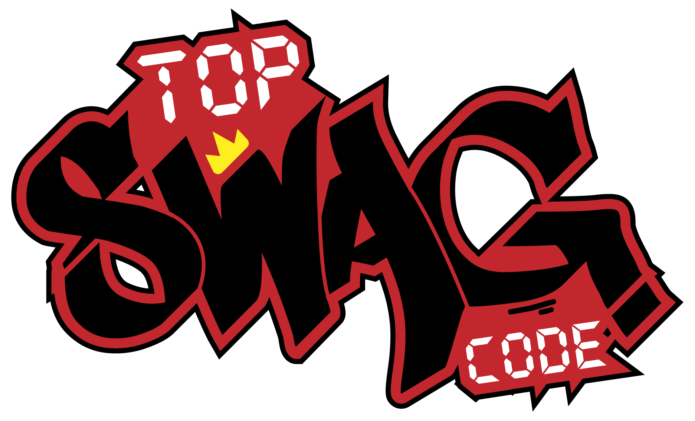
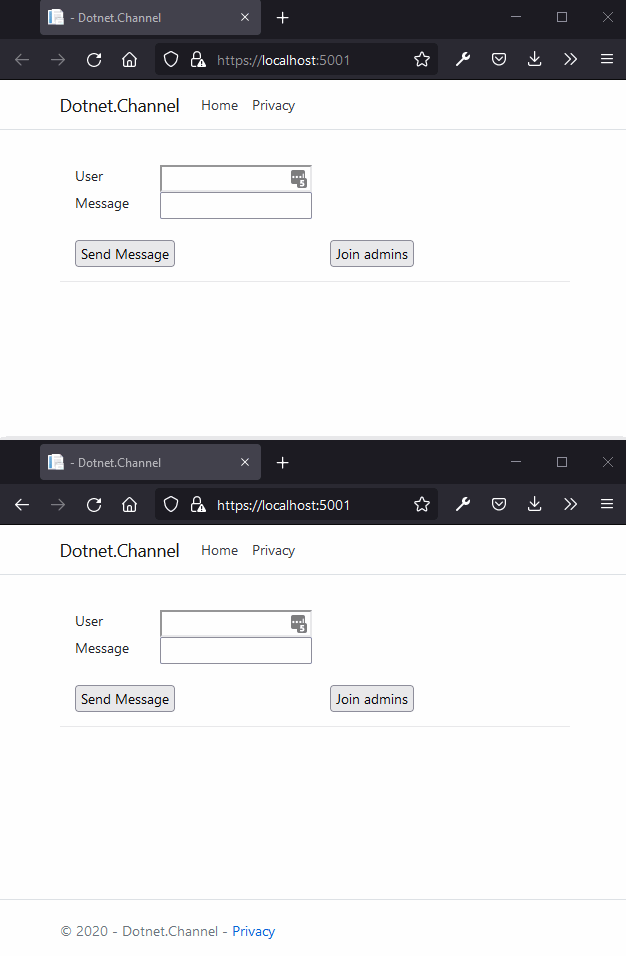

# Dotnet.Channel

<a href="https://sonarcloud.io/dashboard?id=Dotnet.Channel"></a>
<a href="https://github.com/TopSwagCode/Dotnet.Channel/actions/workflows/main.yml"></a>

<a href="https://docs.microsoft.com/en-us/aspnet/core/?view=aspnetcore-3.1"></a>
<a href="https://topswagcode.com/"></a>

Channels enable a producer to safely pass data over to a consumer along with the appropriate notifications in both directions. Channels is an awesome feature I rarely see being used in the wild. In this repository, I have included 2 projects. A simple Console APP showing some basic usage of Channels. A more advanced example showing a channel being used for real time notifications using SignalR. I have seen a bunch of implementations of doing this using Queues and what not. But I really love how simple it can be done using channels.

```c#
await foreach (var notification in _notificationChannel.Reader.ReadAllAsync(stoppingToken))
{
    // Do your notification logic here.
}
```

With C# 8 support for iterating with Async Enumerables, it really just looks nice and clean.

The advanced example is a small SignalR / WebSockets app, that show notifications to admin users, when new admins joins or a user visiting the private page. GIF below



Microsoft also have a example for using a channel for a background queue with limits here: https://docs.microsoft.com/en-us/aspnet/core/fundamentals/host/hosted-services?view=aspnetcore-5.0&tabs=visual-studio#queued-background-tasks

Below I have included some good links for getting to know Channels a bit better, by either reading some good blog posts or reading the implementations details of the Channel (If your into that stuff like me :D ).

* https://github.com/dotnet/corefx/tree/master/src/System.Threading.Channels/src/System/Threading/Channels
* https://github.com/dotnet/corefx/blob/master/src/System.Threading.Channels/src/System/Collections/Generic/Deque.cs
* https://devblogs.microsoft.com/dotnet/an-introduction-to-system-threading-channels/ 
* https://ndportmann.com/system-threading-channels/
* https://www.stevejgordon.co.uk/an-introduction-to-system-threading-channels

As a bonus in this repository, I have added Github actions and Sonarqube code quality checker. This is currently just for testing out if it is something I want to add to all my public repositories.

## TODO:

* Add Unit tests
* Add Codecoverage
* Make youtube video about it all and link here.
* Maybe a SwagBits video.
* Trigger build
